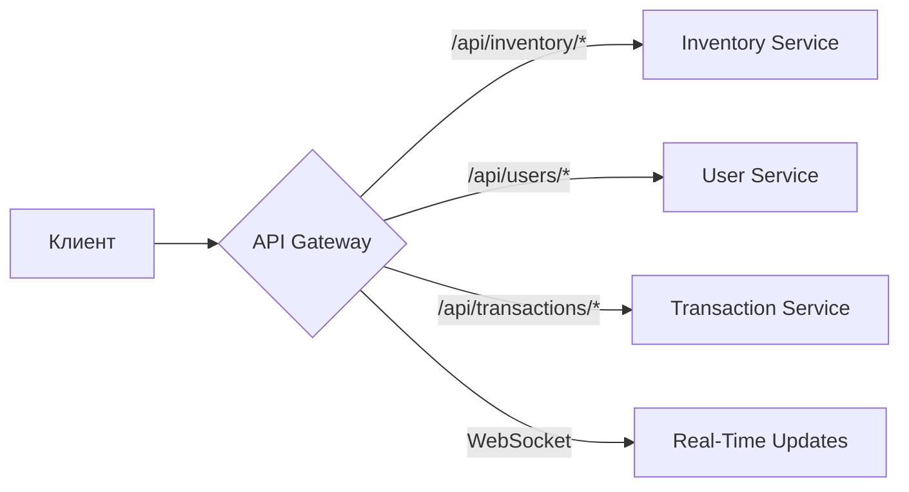

```mermaid
flowchart LR
    A[Клиент] --> B{API Gateway}
    B -->|/api/inventory/*| C[Inventory Service]
    B -->|/api/users/*| D[User Service]
    B -->|/api/transactions/*| E[Transaction Service]
    B -->|WebSocket| F[Real-Time Updates]
```
