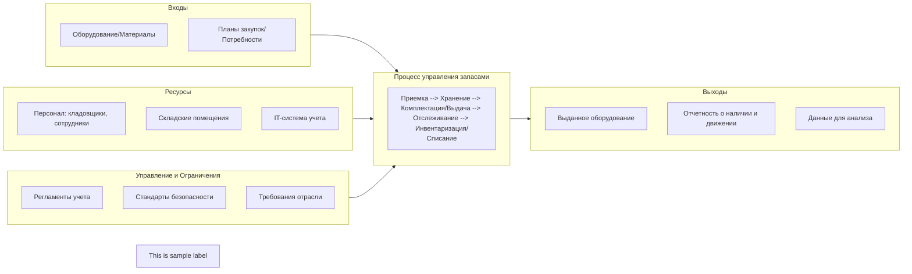

```mermaid
flowchart LR
 subgraph Inputs["Входы"]
        A["Оборудование/Материалы"]
        B["Планы закупок/Потребности"]
  end
 subgraph Controls["Управление и Ограничения"]
        C["Регламенты учета"]
        D["Стандарты безопасности"]
        E["Требования отрасли"]
  end
 subgraph Process["Процесс управления запасами"]
        P["Приемка --> Хранение --> Комплектация/Выдача --> Отслеживание --> Инвентаризация/Списание"]
  end
 subgraph Resources["Ресурсы"]
        F["Персонал: кладовщики, сотрудники"]
        G["Складские помещения"]
        H["IT-система учета"]
  end
 subgraph Outputs["Выходы"]
        I["Выданное оборудование"]
        J["Отчетность о наличии и движении"]
        K["Данные для анализа"]
  end
    Inputs --> Process
    Resources --> Process
    Controls --> Process
    Process --> Outputs
    n1["This is sample label"]


```
