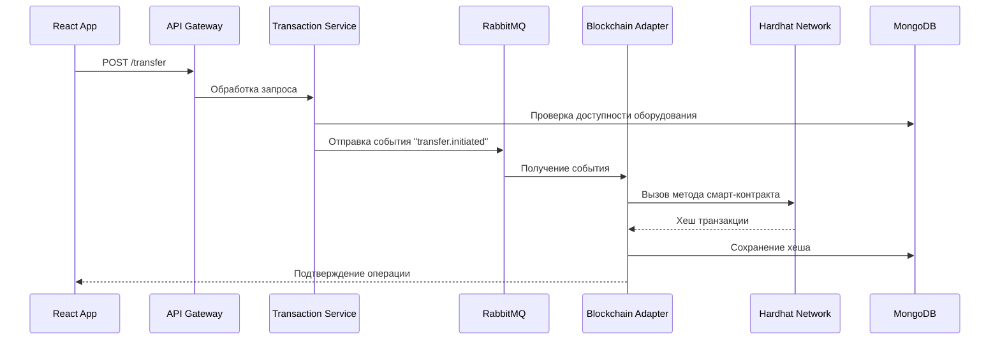

```mermaid
sequenceDiagram
    participant React as React App
    participant API as API Gateway
    participant TxService as Transaction Service
    participant RabbitMQ as RabbitMQ
    participant Blockchain as Blockchain Adapter
    participant Hardhat as Hardhat Network
    participant MongoDB as MongoDB

    React->>API: POST /transfer
    API->>TxService: Обработка запроса
    TxService->>MongoDB: Проверка доступности оборудования
    TxService->>RabbitMQ: Отправка события "transfer.initiated"
    RabbitMQ->>Blockchain: Получение события
    Blockchain->>Hardhat: Вызов метода смарт-контракта
    Hardhat-->>Blockchain: Хеш транзакции
    Blockchain->>MongoDB: Сохранение хеша
    Blockchain-->>React: Подтверждение операции
```
