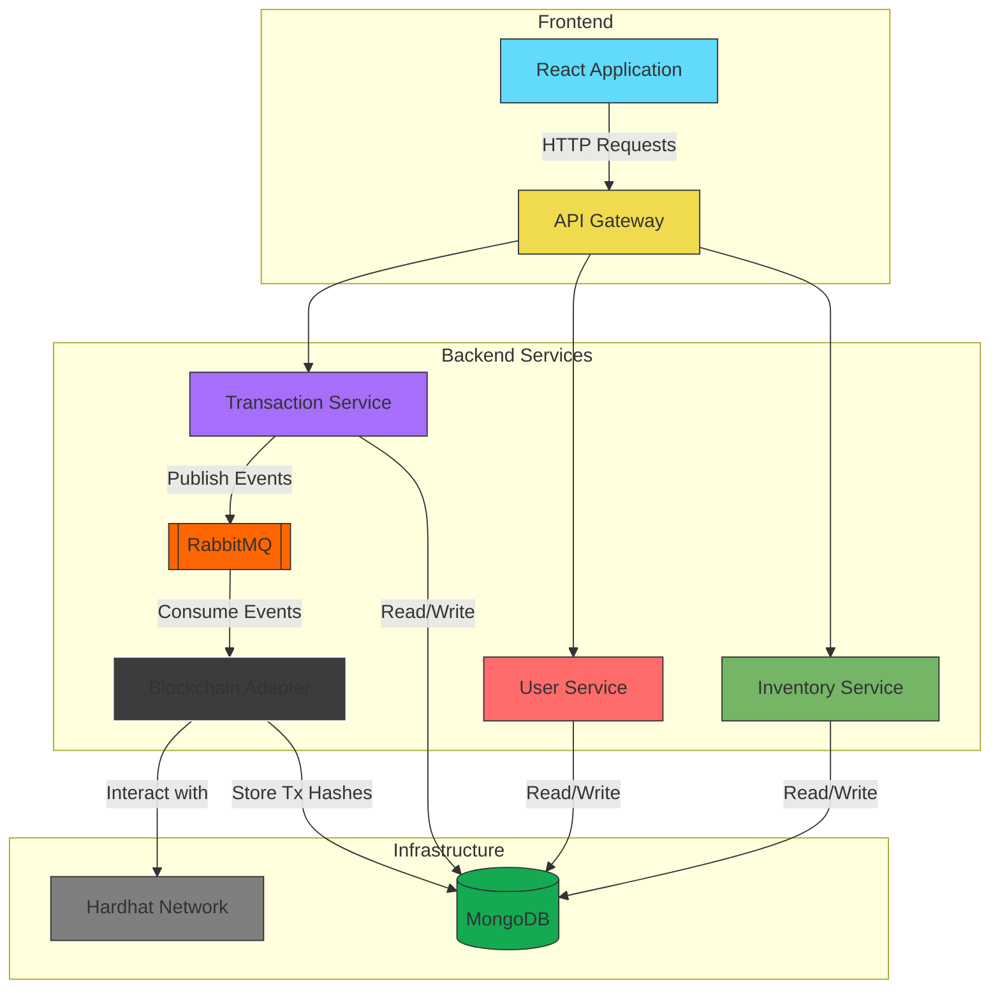

```mermaid
%% Диаграмма архитектуры системы
graph TD
    subgraph Frontend
        A[React Application] -->|HTTP Requests| B[API Gateway]
    end

    subgraph Backend Services
        B --> C[Inventory Service]
        B --> D[User Service]
        B --> E[Transaction Service]

        E -->|Publish Events| F[[RabbitMQ]]
        F -->|Consume Events| G[Blockchain Adapter]
    end

    subgraph Infrastructure
        G -->|Interact with| H[Hardhat Network]
        C -->|Read/Write| I[(MongoDB)]
        D -->|Read/Write| I
        E -->|Read/Write| I
        G -->|Store Tx Hashes| I
    end

    style A fill:#61dafb,stroke:#333
    style B fill:#f0db4f,stroke:#333
    style C fill:#74b566,stroke:#333
    style D fill:#ff6b6b,stroke:#333
    style E fill:#a66efa,stroke:#333
    style F fill:#ff6600,stroke:#333
    style G fill:#3c3c3c,stroke:#fff
    style H fill:#7f7f7f,stroke:#333
    style I fill:#13aa52,stroke:#333

```
