# Архитектура системы автоматизации учета складских запасов нефтегазового предприятия с использованием блокчейн-системы и смарт-контрактов

## Содержание

- [1. Введение](#1-введение)
- [2. Обзор архитектуры](#2-обзор-архитектуры)
- [3. Микросервисная архитектура](#3-микросервисная-архитектура)
- [4. Блокчейн-компонент](#4-блокчейн-компонент)
- [5. Модель данных](#5-модель-данных)
- [6. Потоки данных](#6-потоки-данных)
- [7. Технический стек](#7-технический-стек)
- [8. Аспекты безопасности](#8-аспекты-безопасности)
- [9. Масштабируемость системы](#9-масштабируемость-системы)
- [10. Заключение](#10-заключение)

## 1. Введение

Данный документ описывает архитектуру системы автоматизации учета складских запасов нефтегазового предприятия с использованием блокчейн-технологии и смарт-контрактов. Система предназначена для отслеживания оборудования на всех этапах его использования, включая выдачу со склада, передачу между сотрудниками и возврат.

### 1.1 Цели системы

- Автоматизация процессов учета складских запасов
- Обеспечение прозрачности и неизменяемости истории передвижения оборудования
- Минимизация человеческого фактора при учете оборудования
- Оптимизация бизнес-процессов, связанных с управлением складскими запасами
- Создание надежной и безопасной системы с распределенным реестром

### 1.2 Основные функциональные требования

- Регистрация и учет оборудования
- Отслеживание местонахождения и статуса оборудования в реальном времени
- Фиксация всех передач оборудования в блокчейне
- Контроль ответственности владельцев оборудования
- Формирование отчетов и аналитических данных
- Уведомление участников о событиях, связанных с оборудованием

## 2. Обзор архитектуры

Система построена на основе микросервисной архитектуры с интеграцией блокчейн-технологии для обеспечения неизменяемости данных.

### 2.1 Общая архитектура системы

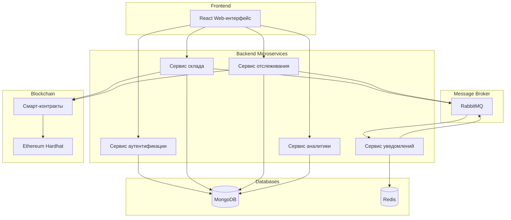

### 2.2 Ключевые компоненты системы

1. **Frontend**: React-приложение для взаимодействия с системой
2. **Микросервисы**: Набор независимых сервисов, реализующих бизнес-логику
3. **Message Broker**: RabbitMQ для асинхронного взаимодействия между сервисами
4. **База данных**: MongoDB для хранения основных данных
5. **Кэш**: Redis для кэширования данных и управления сессиями
6. **Блокчейн**: Ethereum (локальная сеть Hardhat) и смарт-контракты

### 2.3 Контейнеризация и оркестрация

Вся система развертывается в контейнерах Docker с использованием Docker Compose для управления всеми компонентами.

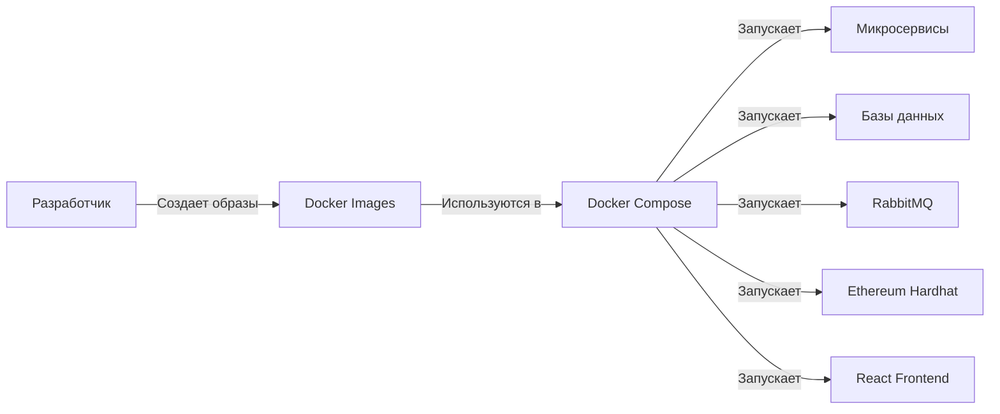

## 3. Микросервисная архитектура

Система разделена на несколько независимых микросервисов, каждый из которых выполняет определенную функцию.

### 3.1 Сервис аутентификации (Authentication Service)

Отвечает за регистрацию пользователей, аутентификацию и авторизацию, управление ролями и правами доступа.

**Основные функции:**

- Регистрация пользователей
- Аутентификация (JWT токены)
- Управление ролями (администратор, кладовщик, сотрудник)
- Управление правами доступа
- Интеграция с системой блокчейн-идентификации

### 3.2 Сервис склада (Warehouse Service)

Управляет информацией об оборудовании на складе, операциями по учету и движению.

**Основные функции:**

- Управление инвентарем
- Регистрация нового оборудования
- Выдача оборудования со склада
- Прием оборудования на склад
- Проведение инвентаризации
- Генерация уведомлений о событиях через RabbitMQ

### 3.3 Сервис отслеживания (Tracking Service)

Отвечает за отслеживание перемещения оборудования и регистрацию передач в блокчейне.

**Основные функции:**

- Регистрация передач оборудования между сотрудниками
- Запись событий в блокчейн через смарт-контракты
- Отслеживание местонахождения оборудования
- Обеспечение прозрачности истории владения
- Валидация транзакций передачи

### 3.4 Сервис уведомлений (Notification Service)

Обрабатывает и отправляет уведомления пользователям о различных событиях в системе.

**Основные функции:**

- Обработка событий из RabbitMQ
- Определение получателей уведомлений
- Отправка уведомлений через различные каналы (email, web-push, in-app)
- Хранение статуса уведомлений
- Группировка и приоритизация уведомлений

### 3.5 Сервис аналитики (Analytics Service)

Формирует отчеты и аналитические данные на основе информации о движении оборудования.

**Основные функции:**

- Генерация различных типов отчетов
- Анализ эффективности использования оборудования
- Прогнозирование потребностей в оборудовании
- Выявление нестандартных ситуаций
- Статистический анализ данных

### 3.6 Взаимодействие микросервисов

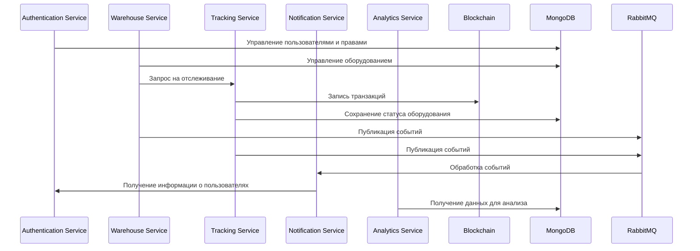

## 4. Блокчейн-компонент

Блокчейн-компонент является ключевой частью системы, обеспечивающей неизменяемость и прозрачность истории движения оборудования.

### 4.1 Архитектура блокчейн-компонента

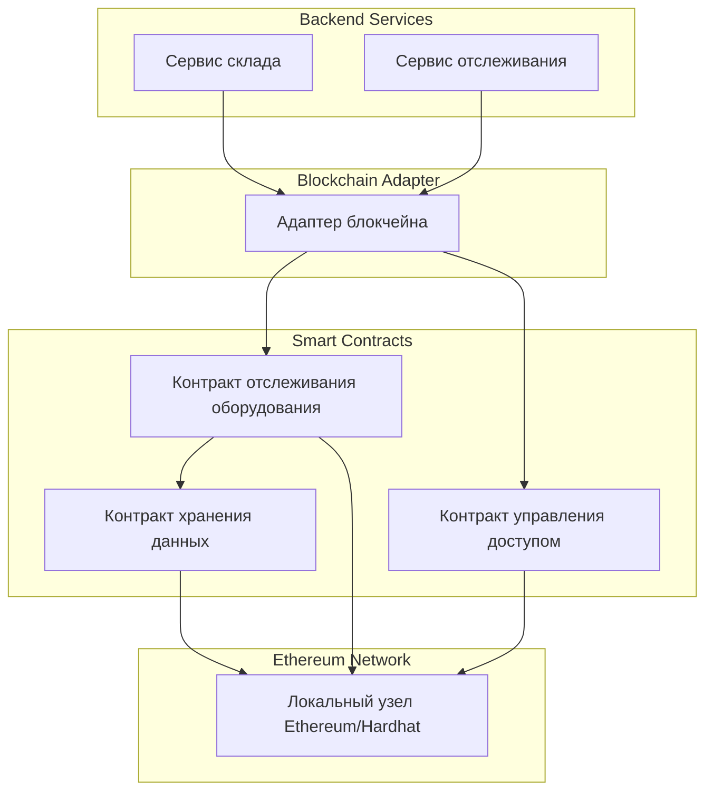

### 4.2 Смарт-контракты

Система использует несколько смарт-контрактов для реализации бизнес-логики.

#### 4.2.1 Контракт отслеживания оборудования (EquipmentTracking)

Основной контракт, отвечающий за регистрацию и отслеживание оборудования.

**Основные функции:**

- Регистрация нового оборудования
- Выдача оборудования со склада
- Передача оборудования между сотрудниками
- Возврат оборудования на склад
- Хранение истории передач
- Предоставление информации о текущем владельце

#### 4.2.2 Контракт управления доступом (AccessControl)

Отвечает за управление правами доступа к функциям других смарт-контрактов.

**Основные функции:**

- Определение ролей (администратор, кладовщик, сотрудник)
- Назначение ролей пользователям
- Проверка прав доступа к функциям
- Управление привилегиями

#### 4.2.3 Контракт хранения данных (DataStorage)

Отвечает за хранение дополнительной информации об оборудовании.

**Основные функции:**

- Хранение метаданных оборудования
- Хранение информации о техническом обслуживании
- Хранение информации о сроках эксплуатации
- Интеграция с основным контрактом отслеживания

### 4.3 Взаимодействие с блокчейном

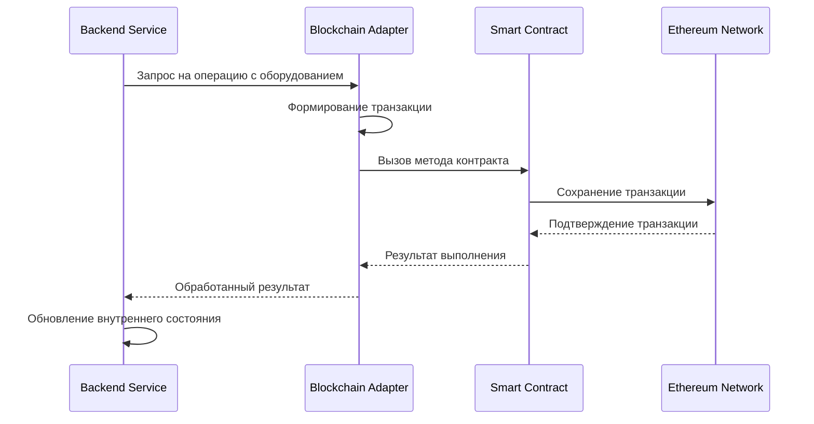

## 5. Модель данных

### 5.1 Схема базы данных MongoDB

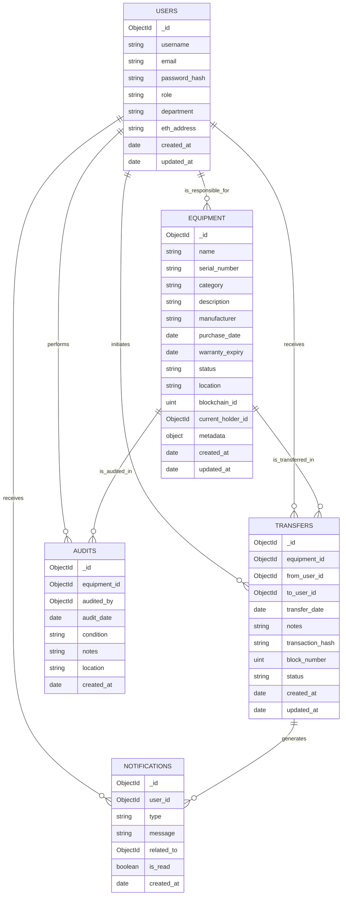

### 5.2 Структура блокчейн-данных

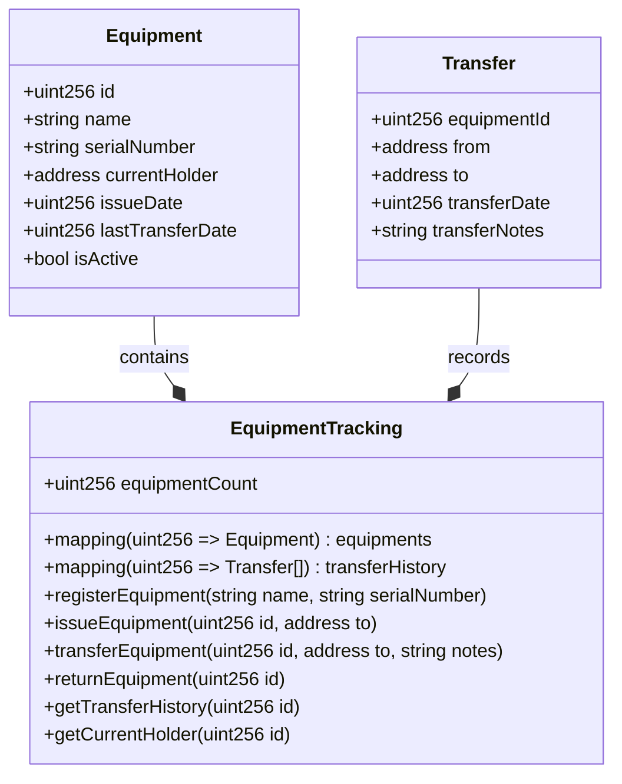

## 6. Потоки данных

### 6.1 Регистрация нового оборудования

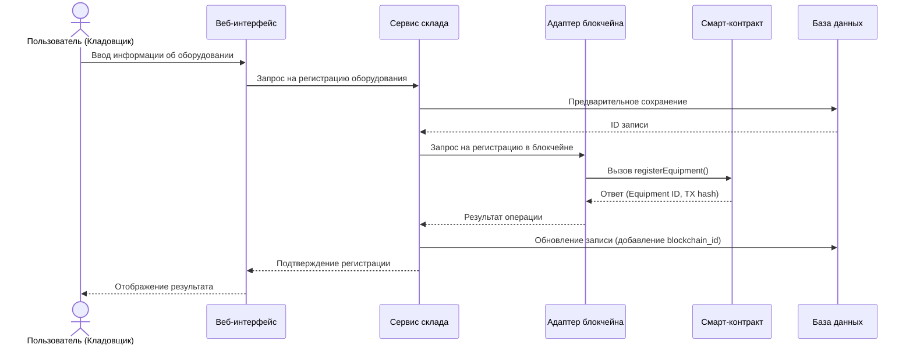

### 6.2 Выдача оборудования со склада

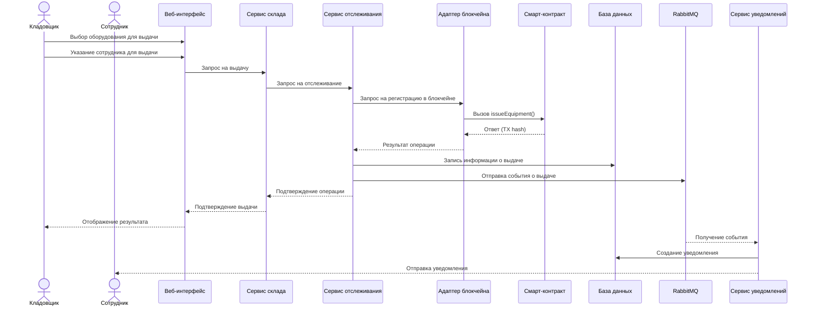

### 6.3 Передача оборудования между сотрудниками

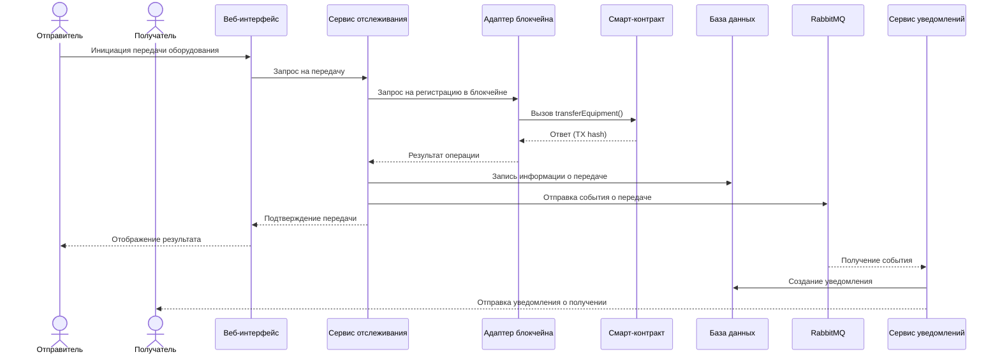

### 6.4 Возврат оборудования на склад

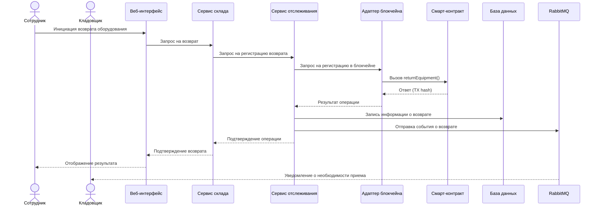

## 7. Технический стек

### 7.1 Основные технологии

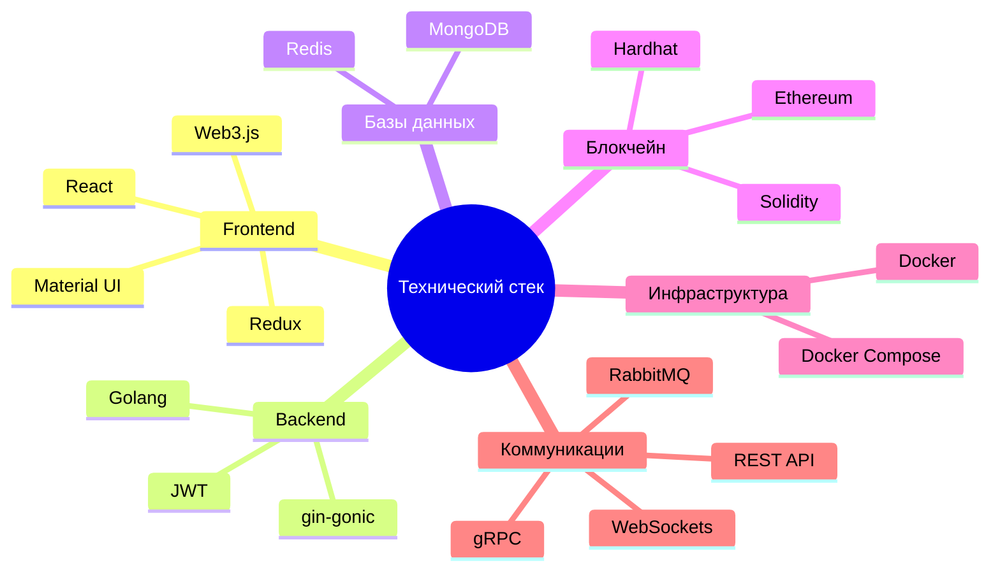

### 7.2 Выбор технологий

| Компонент         | Технология         | Обоснование выбора                                                  |
| ----------------- | ------------------ | ------------------------------------------------------------------- |
| Frontend          | React              | Популярный фреймворк с богатой экосистемой и компонентным подходом  |
| Backend           | Golang             | Производительность, легкая конкурентность, статическая типизация    |
| API               | REST, gRPC         | REST для внешних интеграций, gRPC для внутреннего взаимодействия    |
| База данных       | MongoDB            | Гибкость схемы, масштабируемость, поддержка сложных запросов        |
| Кэширование       | Redis              | Высокая производительность, поддержка различных структур данных     |
| Очереди сообщений | RabbitMQ           | Надежность, гибкая маршрутизация, поддержка различных паттернов     |
| Блокчейн          | Ethereum (Hardhat) | Поддержка смарт-контрактов, зрелая экосистема, локальная разработка |
| Контейнеризация   | Docker             | Изоляция, повторяемость окружения, легкое развертывание             |
| Оркестрация       | Docker Compose     | Управление многоконтейнерными приложениями, простота использования  |

## 8. Аспекты безопасности

### 8.1 Модель безопасности

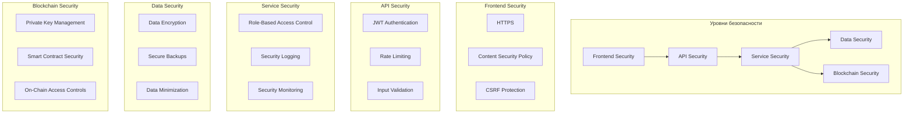

### 8.2 Ключевые аспекты безопасности

1. **Аутентификация и авторизация**:

   - Многофакторная аутентификация для административных функций
   - JWT токены с коротким сроком жизни
   - Детальное разграничение прав доступа на основе ролей
   - Аудит доступа и действий пользователей

2. **Безопасность данных**:

   - Шифрование чувствительных данных в MongoDB
   - Шифрование данных при передаче (TLS/SSL)
   - Минимизация хранимых персональных данных
   - Регулярное резервное копирование данных

3. **Безопасность блокчейна**:

   - Безопасное хранение приватных ключей
   - Аудит безопасности смарт-контрактов
   - Ограничение функций смарт-контрактов на основе ролей
   - Мониторинг транзакций блокчейна

4. **Безопасность инфраструктуры**:
   - Изоляция контейнеров Docker
   - Ограничение сетевого доступа между сервисами
   - Регулярное обновление зависимостей
   - Сканирование уязвимостей

## 9. Масштабируемость системы

### 9.1 Горизонтальное масштабирование

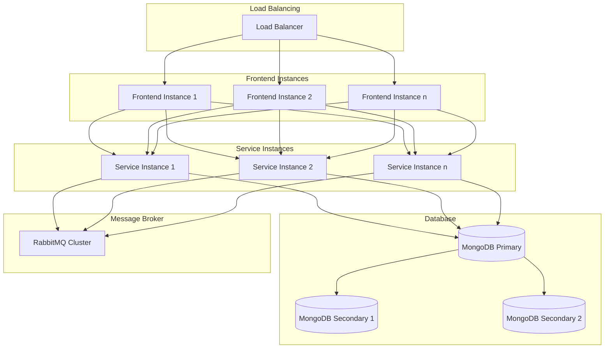

### 9.2 Стратегии масштабирования

1. **Микросервисная архитектура**:

   - Независимое масштабирование каждого сервиса
   - Добавление новых экземпляров сервисов при повышении нагрузки
   - Балансировка нагрузки между экземплярами

2. **Репликация базы данных**:

   - Репликация MongoDB для высокой доступности
   - Шардирование коллекций для распределения нагрузки
   - Оптимизация индексов для улучшения производительности запросов

3. **Кэширование**:

   - Использование Redis для кэширования часто запрашиваемых данных
   - Распределенное кэширование для уменьшения нагрузки на базу данных
   - Стратегии инвалидации кэша

4. **Асинхронная обработка**:

   - Использование RabbitMQ для асинхронного взаимодействия
   - Обработка длительных операций в фоновом режиме
   - Буферизация сообщений при пиковых нагрузках

5. **Балансировка блокчейн-операций**:
   - Группировка транзакций для оптимизации использования газа
   - Кэширование результатов вызовов смарт-контрактов
   - Асинхронный мониторинг событий блокчейна

## 10. Заключение

Предложенная архитектура системы автоматизации учета складских запасов нефтегазового предприятия с использованием блокчейн-технологии представляет собой комплексное решение, которое обеспечивает:

1. **Надежность и прозрачность** учета оборудования благодаря использованию блокчейна для фиксации всех передвижений и передач
2. **Гибкость и расширяемость** за счет микросервисной архитектуры
3. **Масштабируемость** для обработки растущего объема данных и пользователей
4. **Безопасность** на всех уровнях системы
5. **Эффективность бизнес-процессов** благодаря автоматизации и прозрачности

Система разработана с учетом современных практик разработки программного обеспечения и использует стек технологий, обеспечивающий высокую производительность, надежность и удобство разработки.

В дальнейшем система может быть расширена дополнительными модулями, такими как:

- Интеграция с IoT устройствами для автоматического отслеживания оборудования
- Система прогнозирования потребностей в оборудовании на основе AI/ML
- Интеграция с ERP и другими корпоративными системами
- Мобильное приложение для удобства работы сотрудников в полевых условиях

```

```
